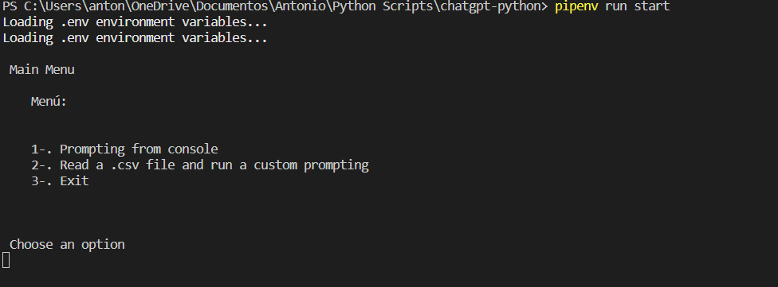

Versión de Python: 3.10.6 
<br/>
pip install --user pipenv
<br/>
<a href="https://platform.openai.com/account/api-keys">OpenAI API</a>
<br/>

Step 1: Create .env from .env.example <br/>
```sh 
cp .env.example .env 
```
<br/>
<br/>
Step 2: Setup your API Key in .env
<br/>
<br/>
Paso3:

```sh
pipenv shell 
``` 
<br/>
<br/>
Step 4-A (for virtual environment):

```sh
pipenv install 
``` 

Step 4-B (withou virtual environment, install libraries globally):

```sh
pip install openai python-dotenv requests
``` 
<br/>
<br/>
Step 5-A (run virtual environment): 

```sh
pipenv run start 
``` 

Step 5-B (run globally): 

```sh
python main.py
``` 

## Preview
</img>

